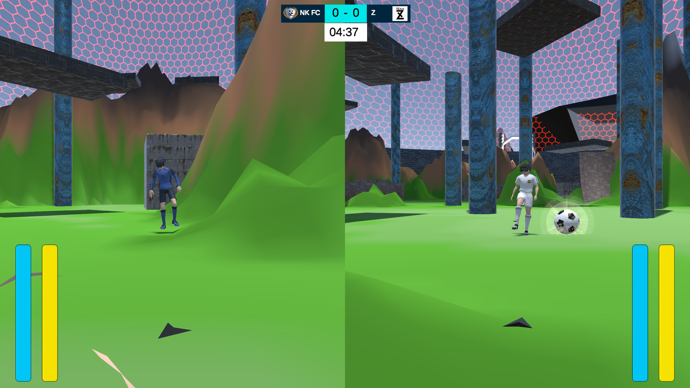

# BallArena

If you want to test the game, please go to my itch.io page : [Al3xics](https://al3xics.itch.io/). Open the game named **"BallArena"** and play ! 
If you want to quit the game, please press **escape**, and go back to the menu (button named **"Retourner Au Menu"**, the last one), and press **"Quitter"**. 
 

This project was made in 2 weeks, and is about **experimenting with procedural generation** (**Poisson Disc Sampling** and **Perlin Noise**). 
2 people worked on this game (including myself). 
Because of a lack of time (a few days at most), we couldn't correct the small problems/bugs that could appear. 
 

Try to play the game and discover what need improvement, is well-made, or badly made, ... 
 

### Have fun !!
 

# Here are some images of the game : 

